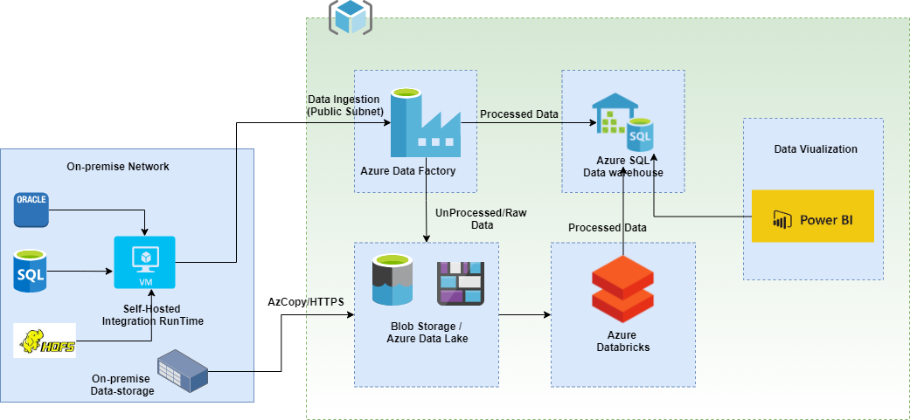

# azure-etl-architecture

This project explains the architecture for Big-Data/ETL pipelines using Azure Data Factory, Integration Runtime, Azure Databricks, AzCopy, Blob storage, Azure Synapse, Power BI etc. 

### Proposed architecture

